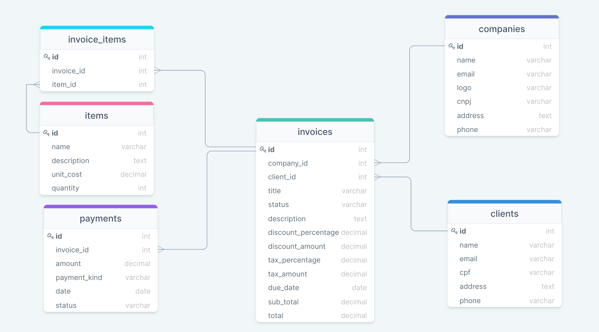

# Desafio - Husky

Desafio proposto: desenvolver um gerador de invoices online.

Para mais detalhes veja os requisitos para o projeto: [Requisitos do desafio](challenge.md)

## O projeto
Como detalhado nos requisitos do desafio, será desenvolvido um gerador de invoices online, seguindo um mix dos examplos apresentados:

- https://invoice.husky.io/
- https://www.invoicesimple.com/invoice-generator

Para o bom entendimento e melhor implementação do projeto seguirei a seguinte estrutura:

- Entender para atender;
- Modelagem do banco de dados;
- Passo a passo para rodar o projeto local;
- Passo a passo para rodar o projeto com Docker;
- Detalhes da implementação

## Entender para atender
### O que é uma Invoice (fatura)?
Uma fatura é um documento comercial que busca detalhar o produto vendido ou o serviço prestado, sem que seja necessário ou que seja solicitado pelo cliente ou pelo comprador.

A fatura pode ser usada tanto para fins fiscais, como também como forma de proteger o cliente, como para questões de garantia, por exemplo.

Ao emitir uma fatura, é feito o detalhamento de uma transação comercial, especificando as características do produto ou serviço e o valor referente à compra.

A fatura representa uma conta e é sempre emitida pela empresa que realizou a venda ou prestou os serviços.

Geralmente, a fatura é emitida em compras feitas a prazo e em operações nas quais ainda não houve a efetivação do pagamento.

É fundamental que os dados cadastrais estejam corretos e atualizados para que a fatura seja enviada ao endereço e/ou ao email cadastrado.

O pagamento de uma fatura pode ocorrer de duas formas distintas. A primeira é o pagamento integral. Nele, o valor total é pago até o dia do vencimento. A outra opção é o pagamento parcial. Nesse caso, o cliente paga apenas uma parte do valor total e o restante é refinanciado. Vale lembrar que podem ser cobrados juros em cima do valor devido.

## Modelagem do Banco de Dados


## Executando o projeto

 -->   **Pré-requisitos**

- Ruby - 2.7.4

- Rails - 6.1.4

- PostgreSQL

 -->   **Passo a passo**
1. Criar o banco de dados
	```
	rails db:create
	```
2. Executar as migrações
	```
	rails db:migrate
	```
3. Instalar gems e dependências
	```
	bundle install
	```
	```
	yarn install
	```
5. Executar os testes
	```
	bin/rails test
	```
6. Executar a aplicação
	```
	rails server
	```

### Para acessar os endpoints da API:

Uma breve documentação da API:
https://documenter.getpostman.com/view/17174426/UUxzA7yN


### Cenário, hipóteses e expectativas
No projeto procurei separar os casos de uso para cada domínio da aplicação com o objetivo de alcançar a arquitetura proposta no Clean Arch. E além disso proporcionar uma maior facilidade na manutenção, nos testes e na criação de novas features.

Procurei deixar as partes mais importantes prontas, para que o projeto pudesse em seu roadmap ir crescendo com o minimo de efeitos colatareis. Para isso utilizei o RubyCritic para analize da complexidade e churn do código. Utilizei também o simplecov para analise da cobertura de testes.

Os casos de uso foram gerados utilizando como suporte a gem U-Case, o que garantiu um código mais modular, expressivo e sequencialmente lógico.

No frontend coloquei o foco em deixar o mais simples possível para o MVP, onde em um primeiro momento já seremos capazes de criar a invoice e visualizar a invoice.

## Próximos passos e melhorias

### Segurança
- Criar o model de usuário;
- Implementar os casos de uso e testes do usuário para signup, login, logout;
- Implementar os endpoints e testes usuário para signup, login, logout;
- Implementar os casos de uso e testes do usuário visitante; 
- Implementar o caso de uso e testes para a geração do Token da API;

### Invoice
- Aumentar a cobertura de testes;
- Separar as responsabilidades do model invoice para um model e repository;
- Implementar o caso de uso e testes para editar/salvar invoices com o status rascunho (draft);
- Melhorar e implementar os testes para o endpoint de editar/salvar invoices com o status rascunho (draft);
- Criar um area administrativa para o usuário logado poder visualizar a lista de invoices;
- Criar uma tela em que usuário como visitante possa gerar e enviar a invoice;
- Enviar o PDF em anexo também no email enviado;
- Gerar/implementar e adicionar no email o has do arquivo PDF (SHA256);

### FrontEnd
- Criar componentes reutilizáveis;
- Criar os prototipos com foco em UX;
- Adicionar um preview da invoice;
- Adicioanar funções e classes para que possa ser calculado o total da invoice automáticamente;
- Adicionar componentes e tela para o perfil do usuário;
